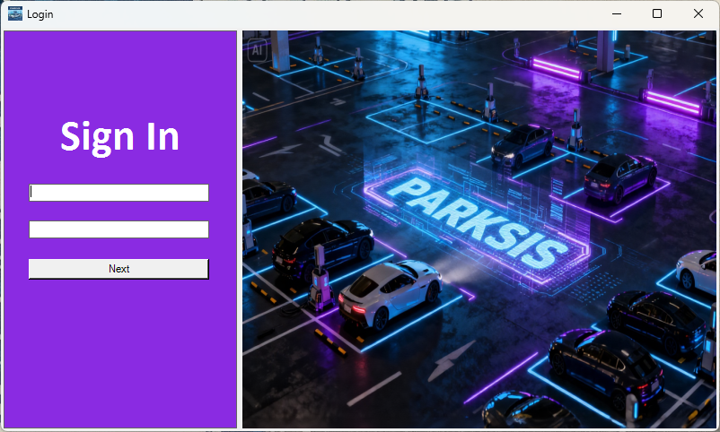

# PARKSIS

Parking System Integrated Solution:  A mini project to refresh my technical knowledge about VB.NET (Desktop App) and Python with FASTAPI. 

**Why desktop app?** 

A desktop application may be preferred for a parking system over a web browser due to advantages in **reliability**, **performance**, **offline access**, and enhanced **hardware control**.

## Snapshot

### Splash screen

### Login

